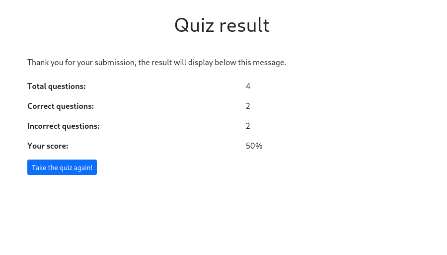

# Golang assessment

This repository contains a basic assessment of Golang.

## Folder structure

This repository contains an API (backend) and APP (fronted).

- `/cmd/api` That folder contains the API
- `/cmd/web` That folder contains a web application that consumes the API

## Requirements
- Golang 1.18

## Installation instructions
- Clone this repository: `git clone git@github.com:smarulanda97/assessment-golang.git`
- Move to folder of repository: `cd assessment-golang`
- Copy .env.example to .env: `cp .env.example .env`
- Build the program: `go build`
- Run the program `./assessment-golang`
- Open the web browser and go to the app: `http://localhost:8082/`

## Screenshots

### Page quiz

### Page results

